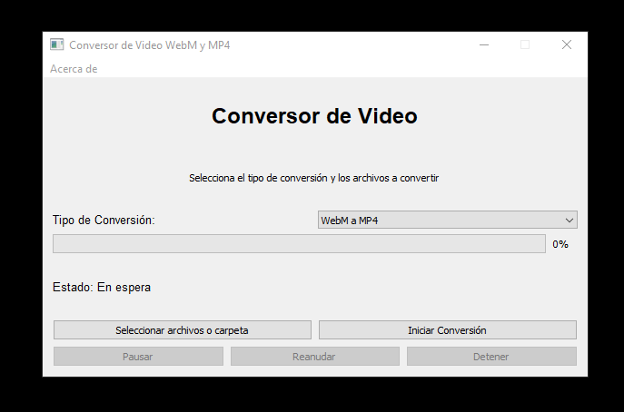

```markdown
# Conversor de Video

**Conversor de Video** es una aplicación de escritorio para convertir archivos de video entre formatos WebM y MP4. Desarrollada en Python con PyQt5, esta aplicación proporciona una interfaz gráfica amigable para seleccionar archivos, configurar conversiones y gestionar el proceso de conversión.

## Requisitos

- **Python 3.x**: Asegúrate de tener Python instalado en tu sistema.
- **PyQt5**: Biblioteca para crear interfaces gráficas en Python.
- **FFmpeg**: Herramienta de línea de comandos para la conversión de video.

## Instalación

### 1. Clonar el Repositorio

Primero, clona el repositorio donde se encuentra el código fuente del proyecto:

```bash
git clone <URL_DEL_REPOSITORIO>
cd <NOMBRE_DEL_REPOSITORIO>
```

### 2. Configurar el Entorno

Instala las dependencias necesarias usando `pip`:

```bash
pip install pyqt5
```

Asegúrate también de tener [FFmpeg](https://ffmpeg.org/download.html) instalado y accesible desde la línea de comandos.
Para instalar y configurar FFmpeg en tu sistema Windows y asegurarte de que esté accesible desde la línea de comandos, sigue estos pasos:

### Instalación y Configuración de FFmpeg en Windows

#### 1. Descargar FFmpeg

1. **Ir al sitio web oficial**: Ve al [sitio web de descargas de FFmpeg](https://ffmpeg.org/download.html).

2. **Seleccionar Windows**: En la sección de Windows, busca el enlace para descargar una versión de FFmpeg. Puedes optar por una versión precompilada de terceros como [Gyan](https://www.gyan.dev/ffmpeg/builds/) o [BtbN](https://github.com/BtbN/FFmpeg-Builds/releases).

3. **Descargar el archivo ZIP**: Descarga el archivo ZIP que contiene los binarios de FFmpeg. El archivo suele tener un nombre como `ffmpeg-release-full.7z`.

#### 2. Extraer los Archivos

1. **Extraer el archivo ZIP**: Usa una herramienta de extracción como [7-Zip](https://www.7-zip.org/) para extraer el contenido del archivo ZIP descargado. Extrae el contenido a una ubicación en tu sistema, por ejemplo, `C:\ffmpeg`.

2. **Estructura de directorios**: Dentro de la carpeta `ffmpeg`, deberías encontrar una subcarpeta `bin` que contiene el archivo ejecutable `ffmpeg.exe`.

#### 3. Configurar el PATH del Sistema

Para poder usar FFmpeg desde cualquier línea de comandos, debes agregar la ruta a `ffmpeg.exe` al PATH del sistema.

1. **Abrir el Panel de Control**:
   - Presiona `Win + R`, escribe `control` y presiona `Enter`.

2. **Ir a Configuración del Sistema**:
   - Ve a **Sistema y Seguridad** > **Sistema**.
   - Haz clic en **Configuración avanzada del sistema** en el panel izquierdo.

3. **Abrir Variables de Entorno**:
   - En la ventana de **Propiedades del sistema**, haz clic en el botón **Variables de entorno**.

4. **Editar la Variable PATH**:
   - En la sección **Variables del sistema**, desplázate hacia abajo y selecciona la variable **Path**.
   - Haz clic en **Editar**.

5. **Agregar la Ruta a FFmpeg**:
   - En la ventana de edición, haz clic en **Nuevo** y añade la ruta a la carpeta `bin` donde está el archivo `ffmpeg.exe`. Por ejemplo, `C:\ffmpeg\bin`.
   - Haz clic en **Aceptar** para cerrar todas las ventanas.

#### 4. Verificar la Instalación

1. **Abrir una Línea de Comandos**:
   - Presiona `Win + R`, escribe `cmd` y presiona `Enter`.

2. **Verificar FFmpeg**:
   - Escribe `ffmpeg -version` y presiona `Enter`.

   Si todo está configurado correctamente, deberías ver la versión de FFmpeg y otra información relevante, tambien puedes reiniciar el computador para ver los cambios reflejados.

### Instalación y Configuración de FFmpeg en Arch Linux

#### 1. Instalar FFmpeg

1. **Actualizar el sistema**:
   Abre una terminal y actualiza tu sistema para asegurarte de que tienes los últimos paquetes y actualizaciones:
   ```bash
   sudo pacman -Syu
   ```

2. **Instalar FFmpeg**:
   Usa el gestor de paquetes `pacman` para instalar FFmpeg:
   ```bash
   sudo pacman -S ffmpeg
   ```

3. **Verificar la Instalación**:
   Verifica que FFmpeg se haya instalado correctamente ejecutando:
   ```bash
   ffmpeg -version
   ```
   Deberías ver la versión de FFmpeg y otra información relevante.

### Instalación y Configuración de FFmpeg en Debian y Ubuntu

#### 1. Instalar FFmpeg

1. **Actualizar el sistema**:
   Abre una terminal y actualiza tu sistema:
   ```bash
   sudo apt update
   sudo apt upgrade
   ```

2. **Instalar FFmpeg**:
   Usa el gestor de paquetes `apt` para instalar FFmpeg:
   ```bash
   sudo apt install ffmpeg
   ```

3. **Verificar la Instalación**:
   Asegúrate de que FFmpeg esté instalado correctamente ejecutando:
   ```bash
   ffmpeg -version
   ```
   Deberías ver la versión de FFmpeg y otra información relevante.

### Configuración del PATH (Solo si se necesita)

En la mayoría de las instalaciones en Arch Linux y Debian/Ubuntu, FFmpeg se instala en una ubicación que ya está incluida en el PATH del sistema, por lo que no deberías necesitar configurar el PATH manualmente. Sin embargo, si necesitas configurar el PATH por alguna razón específica:

#### 1. Configurar el PATH

1. **Abrir el archivo de configuración del shell**:
   - Si usas `bash`, abre el archivo `~/.bashrc`:
     ```bash
     nano ~/.bashrc
     ```
   - Si usas `zsh`, abre el archivo `~/.zshrc`:
     ```bash
     nano ~/.zshrc
     ```

2. **Agregar la Ruta de FFmpeg**:
   Añade la línea siguiente al final del archivo, reemplazando `/path/to/ffmpeg/bin` con la ruta al directorio que contiene `ffmpeg`:
   ```bash
   export PATH="$PATH:/path/to/ffmpeg/bin"
   ```

3. **Actualizar la configuración del shell**:
   - Si editaste `~/.bashrc`, ejecuta:
     ```bash
     source ~/.bashrc
     ```
   - Si editaste `~/.zshrc`, ejecuta:
     ```bash
     source ~/.zshrc
     ```

### 3. Crear el Ejecutable

Utiliza PyInstaller para convertir el script Python en un ejecutable. Asegúrate de tener PyInstaller instalado:

```bash
pip install pyinstaller
```

Luego, crea el ejecutable:

```bash
pyinstaller --onefile --icon=<RUTA_DEL_ICONO> <NOMBRE_DEL_ARCHIVO>.py
```

Esto generará un archivo ejecutable en la carpeta `dist`.

### 4. Crear el Instalador para Windows con Inno Setup

1. **Instala Inno Setup**: Descarga e instala [Inno Setup](https://jrsoftware.org/isinfo.php).

2. **Configura el Script de Instalación**: Usa el siguiente script de Inno Setup para crear el instalador:

   ```ini
   [Setup]
   AppName=Conversor de Video
   AppVersion=1.0
   AppPublisher=Xenon Technologies
   AppPublisherURL=https://xenontechec.netlify.app/
   DefaultDirName={pf}\ConversorDeVideo
   DefaultGroupName=ConversorDeVideo
   OutputBaseFilename=InstaladorConversorDeVideo
   Compression=lzma
   SolidCompression=yes
   PrivilegesRequired=admin
   DisableProgramGroupPage=yes
   UninstallDisplayIcon={app}\favicon.ico
   SetupIconFile=C:\Users\nixon\Documents\validador\nuevo\favicon.ico
   WizardStyle=modern

   [Files]
   ; Incluir el ejecutable generado por PyInstaller
   Source: "C:\Users\nixon\Documents\validador\nuevo\dist\ConversorDeVideo.exe"; DestDir: "{app}"; Flags: ignoreversion

   ; Incluir solo el archivo esencial de FFmpeg
   Source: "C:\Users\nixon\Documents\validador\nuevo\ffmpeg-master-latest-win64-gpl\bin\ffmpeg.exe"; DestDir: "{app}\ffmpeg\bin"; Flags: ignoreversion

   ; Incluir el archivo del icono
   Source: "C:\Users\nixon\Documents\validador\nuevo\favicon.ico"; DestDir: "{app}"; Flags: ignoreversion

   [Run]
   ; Ejecutar tu aplicación después de la instalación sin abrir CMD
   Filename: "{app}\ConversorDeVideo.exe"; Description: "Iniciar Conversor de Video"; Flags: nowait postinstall skipifsilent

   [Icons]
   ; Crear accesos directos en el menú de inicio y en el escritorio con el icono personalizado
   Name: "{autoprograms}\Conversor de Video"; Filename: "{app}\ConversorDeVideo.exe"; IconFilename: "{app}\favicon.ico"
   Name: "{userdesktop}\Conversor de Video"; Filename: "{app}\ConversorDeVideo.exe"; IconFilename: "{app}\favicon.ico"; Tasks: desktopicon

   [Registry]
   ; Agregar FFmpeg al PATH del sistema para que se pueda usar globalmente
   Root: HKLM; Subkey: "SYSTEM\CurrentControlSet\Control\Session Manager\Environment"; ValueType: expandsz; ValueName: "Path"; ValueData: "{app}\ffmpeg\bin"; Flags: preservestringtype

   [Tasks]
   ; Opción para crear icono en el escritorio
   Name: "desktopicon"; Description: "Crear un icono en el escritorio"; GroupDescription: "Tareas adicionales:"; Flags: unchecked

   [Messages]
   SetupWindowTitle=Instalación del Conversor de Video
   SetupAppTitle=Conversor de Video
   ```

   Guarda este script con una extensión `.iss` (por ejemplo, `setup.iss`).

3. **Compila el Instalador**: Abre el script `.iss` en Inno Setup y compílalo para generar el archivo de instalación.

## Uso

1. **Ejecuta el Instalador**: Doble clic en el archivo `.exe` generado para iniciar el proceso de instalación.

2. **Inicia la Aplicación**: Después de la instalación, puedes iniciar la aplicación desde el menú de inicio o desde el escritorio si seleccionaste la opción correspondiente durante la instalación.

3. **Configura y Usa la Aplicación**: Sigue las instrucciones en la interfaz gráfica para seleccionar archivos, configurar el tipo de conversión, y gestionar el proceso.

## Contribuciones

Las contribuciones al proyecto son bienvenidas. Para contribuir:

1. Realiza un fork del repositorio.
2. Realiza tus cambios y prueba la aplicación.
3. Envía un pull request con una descripción de tus cambios.

## Licencia

Este proyecto está bajo la Licencia MIT. Consulta el archivo `LICENSE` para más detalles.

## Contacto

Para consultas o soporte, puedes contactar a los desarrolladores en xenonbusinessti@gmail.com.

## Captura de Pantalla


```

Asegúrate de reemplazar las rutas en el script de Inno Setup con las correctas en tu sistema, y ajustar cualquier otro detalle según tus necesidades específicas.
